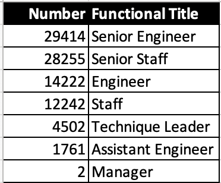

# Pewlett Hackard Employee Retirement Analysis

* Analyst:  
  - Stan Misina
* Analysis Date:  
  - 2021-07-21
* Software tools used:  
  - PostgreSQL Server v11  
  - pgAdmin 4 v5.5  
  - Microsoft VSCode 1.58.2. 
  
## Analysis Overview  
### Retirement Analysis  
With retirement age coming up for many employees in the near future, an anaylisis of company personnel has been produced. We have identified employees by their date of birth, and have compiled a list of candidates along with the number functional titles that will be vacated. This information is scattered across 6 different internal databases, and compiled here for your review.  

### Mentorship Analysis
Along with the expected attrition of the coming "silver tsunami," there will be a great need to replace many positions and therefore our mature staff at Pewlett Hackard can serve as mentors to ensure our company culture and standards can be passed along to the next generation of leaders and senior positions. A roster of projected eligible PH employees that can serve in this mentorship role has been generated and presented here as part of this analysis.  

## Results  
*  There is a large number of functional roles that will be vacated through retirement.  
*  There is an opportunity to evaluate how to move forward in these roles by:
    *  restructuring existing roles  
    *  creating new roles, or   
    *  directly supplanting the retiring employee. 
*  PH has a window to empower our mature employee base by enabling a mentorship program as we fill employment needs
*  This will ensure business continuity and employee engagement as we move into the 21st century as a top tier company

## Summary  
*  There are more than 90,000 current employees [that are near to retirement age.](Data/unique_titles.csv)  
(*determined by birth date*)  
  
*  The functional role of these employees span 7 departments  
  *  Of these roles, nearly 58,000 positions are marked as "senior" level positions  
  
  
*  There are 1549 employees that can serve as [mentors for incoming and upcoming employees.](Data/mentorship_eligibility.csv)  
(*determined by current employees born in 1965*)  
